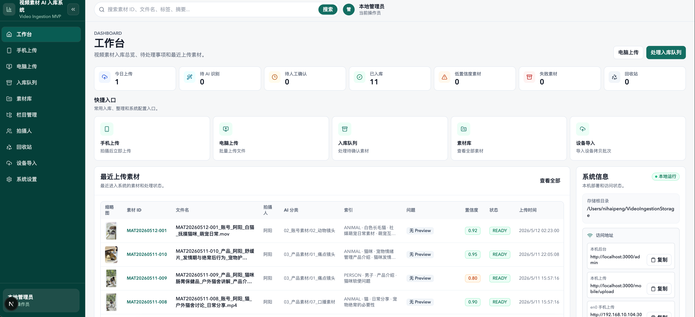
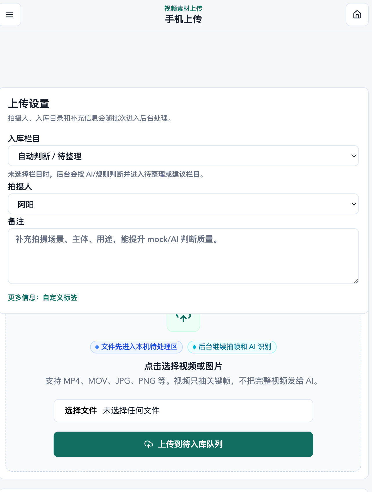
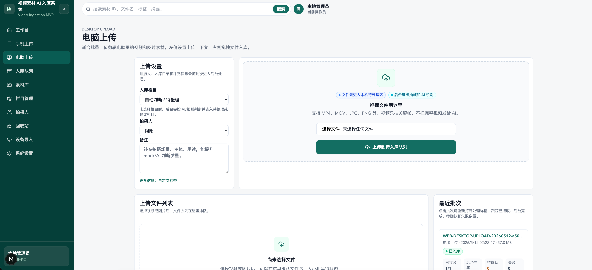
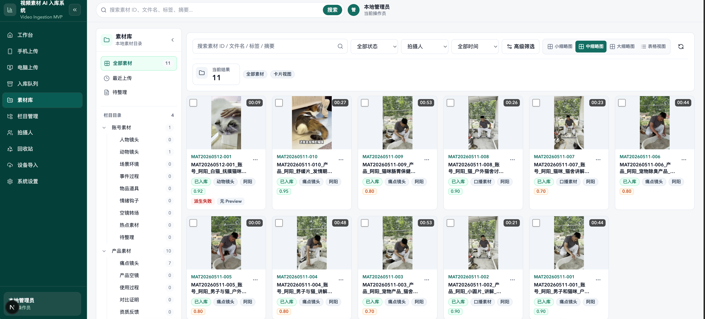
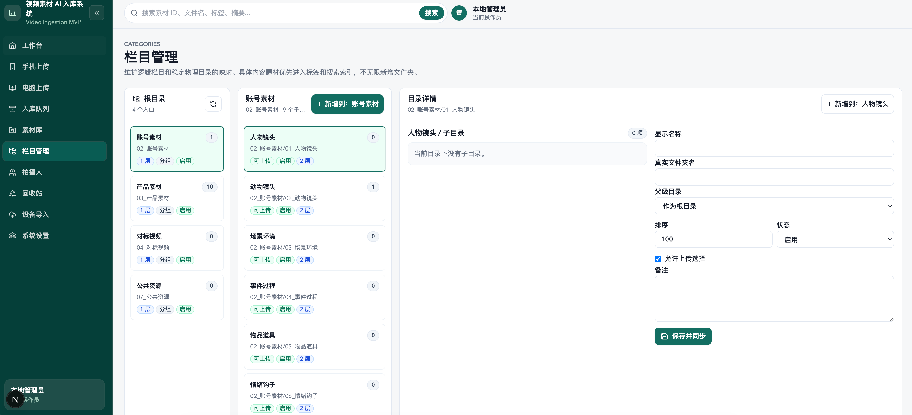
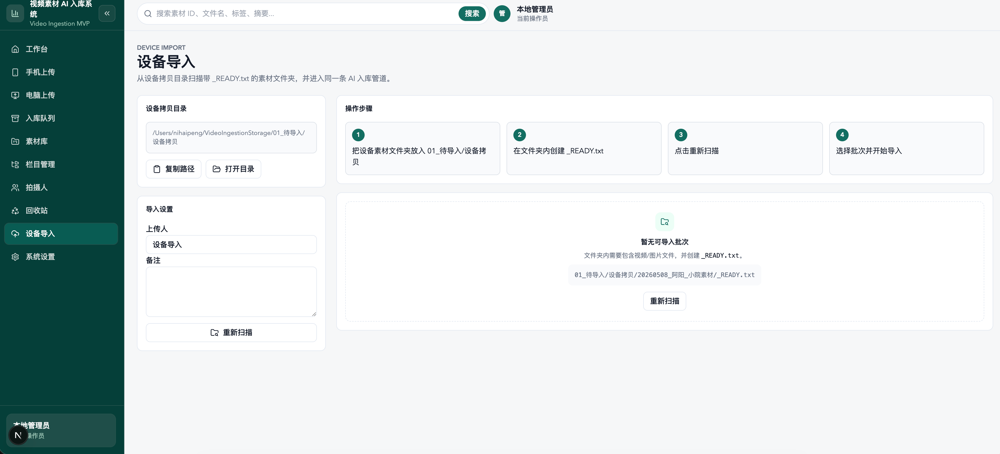
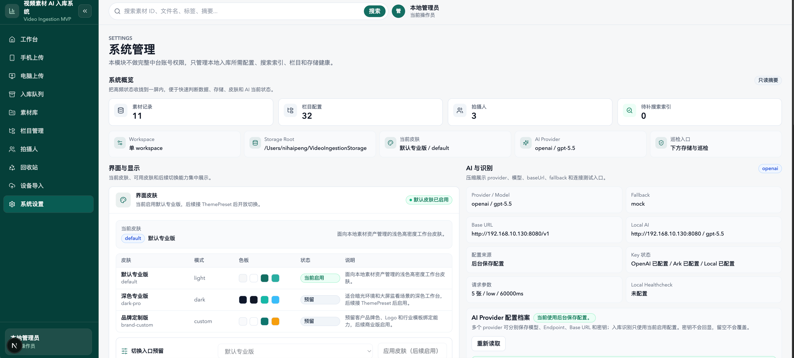

# AI 素材入库系统

一个本地/NAS 优先的视频、图片素材入库与管理系统，支持手机/电脑上传、设备拷贝导入、动态栏目归档、FFmpeg 媒体处理、AI 打标、规范命名、SQLite 记录、素材库搜索、预览、回收站、存储巡检和基础修复。

当前仓库保存第一版 MVP 代码和公开运行说明。接下来计划基于该版本重构 2.0，因此这个版本适合作为可运行参考和社区共建起点。

## 解决什么问题

很多短视频团队、拍摄团队和内容运营团队会遇到同一类素材管理问题：

- 手机、相机、剪辑电脑和移动硬盘里的素材分散保存，后期很难确认“哪个文件已经入库、哪个还没处理”。
- 素材命名依赖人工习惯，文件名里缺少账号、产品、场景、主体、用途等关键信息，搜索和复用成本很高。
- 视频素材太多时，只靠文件夹层级管理不够用，需要标签、摘要、分类、置信度、状态和问题标记一起辅助筛选。
- 直接把完整视频发给云端 AI 成本高，也有隐私顾虑；更适合本地先抽关键帧，再按需交给 AI 做识别。
- NAS 或本地磁盘长期运行后，数据库记录、真实文件、缩略图、预览文件和 metadata JSON 容易不同步，需要巡检和修复入口。
- 小团队往往不需要复杂 SaaS，只需要一个能在本地或局域网跑起来的素材入库后台。

这个项目的目标是把“上传、待处理、AI 初筛、人工确认、分类归档、搜索复用、存储巡检”串成一个本地优先的闭环。

## 核心能力

- 手机上传：拍摄后在局域网内直接上传到待入库队列。
- 电脑上传：批量上传剪辑电脑里的视频和图片素材。
- 设备导入：扫描设备拷贝目录，通过 `_READY.txt` 标记批次后统一导入。
- AI 辅助识别：基于关键帧生成标签、摘要、命名建议和栏目建议。
- 素材库：按栏目、状态、标签、拍摄人、置信度和问题标记搜索素材。
- 栏目管理：维护逻辑栏目和真实物理目录之间的映射。
- 本地存储巡检：检查数据库、metadata、源文件和派生文件的一致性。
- 私有化部署：默认 SQLite + 本地/NAS 存储，不依赖云端 SaaS 账号体系。

## 界面预览

> 建议使用脱敏后的演示素材截图，不要包含真实客户名、密钥、本机敏感路径或未授权素材。















## 项目结构

```text
video-ingestion-mvp/              # Next.js 应用主目录
```

## 快速启动

```bash
cd video-ingestion-mvp
npm install
cp .env.example .env
npm run check:env
npm run db:push
npm run init:workspace
npm run typecheck
npm run dev
```

开发服务默认监听 `0.0.0.0:3000`，手机可通过同一局域网访问：

```text
http://你的电脑局域网IP:3000/mobile/upload
```

更完整的运行说明见 [video-ingestion-mvp/README.md](video-ingestion-mvp/README.md)。

## 开源发布注意

- 不提交 `.env`、API Key、真实数据库、数据库备份、真实素材文件和构建产物。
- 本地默认数据库是 `video-ingestion-mvp/prisma/dev.db`，由 `npm run db:push` 创建。
- AI provider 建议先用 `AI_PROVIDER=mock` 跑通本地流程，再配置 OpenAI、火山方舟或本地兼容服务。
- 第一版偏本地私有化部署，不是 SaaS，多用户权限、支付、云托管等能力不在当前版本范围。

## License

MIT
